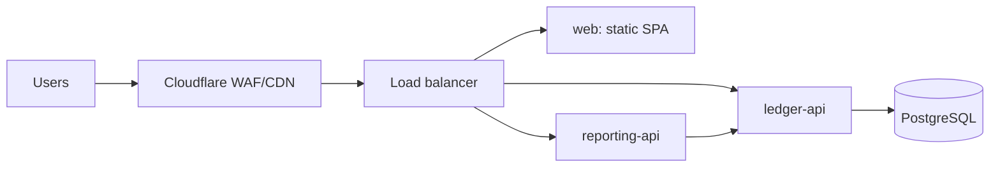

# Infrastructure plan (template)

> **Deliverable.** Fill this in and commit it as `docs/INFRASTRUCTURE-PLAN.md`.
> It is scored (G9) and the bank's reviewer will read it before they approve the
> embed. This file ships as a template — replace every `TODO` and delete the
> guidance you do not need.

|                        |                                                                                              |
| ---------------------- | -------------------------------------------------------------------------------------------- |
| **Author**             | TODO                                                                                         |
| **Date**               | TODO                                                                                         |
| **Target environment** | TODO (Render / AWS / GCP / Azure)                                                            |
| **Status**             | Draft / Review / Approved                                                                    |
| **Related**            | [`SECURITY.md`](SECURITY.md), [`DEPLOYMENT.md`](DEPLOYMENT.md), [`DATABASE.md`](DATABASE.md) |

---

## 1. Executive summary

TODO — five bullets a non-engineer can read. State the target architecture, the
durability guarantee, the cost, and what you deliberately did not build.

- Compute: …
- Data: …
- Edge: …
- Reliability target: … (availability, RPO, RTO)
- Cost: … per month at current traffic

## 2. Current vs target

| Concern       | Today (vibe-coded)      | Target | Why it matters              |
| ------------- | ----------------------- | ------ | --------------------------- |
| Compute       | One VM, one process     | TODO   | Survive payday traffic      |
| Data          | SQLite file, no backups | TODO   | No total data loss          |
| Networking    | Public DB, `*` CORS     | TODO   | Bank review                 |
| Secrets       | Shared password in repo | TODO   | Credential compromise       |
| Observability | None                    | TODO   | Prove 99.9%                 |
| Deploy        | Manual, on the box      | TODO   | Reproducible, rollback-able |

## 3. Architecture

TODO — one diagram (Mermaid or ASCII) of the target. Show: DNS/edge → load
balancer → services → database, plus secret store, registry, and observability.
Label the trust boundaries.

## 4. Environments

| Environment | Purpose                        | Data                  | Access           | Notes               |
| ----------- | ------------------------------ | --------------------- | ---------------- | ------------------- |
| Local       | Developer                      | In-memory or local PG | Any              | Zero-config default |
| Staging     | Pre-prod, migrations rehearsal | Anonymised subset     | Team             | Same shape as prod  |
| Production  | Customers                      | Real                  | Break-glass only | Private networking  |

TODO — say how config differs per environment and how secrets are scoped. Do not
share credentials across environments.

## 5. Compute, scaling and capacity

- Service sizing (CPU/memory per service) and **why** (show the math in §13).
- Autoscaling policy: min/max replicas, the metric it scales on, and cooldowns.
- Concurrency and timeouts per service.
- Cold-start strategy (keep the ledger service warm; `min-instances ≥ 1`).
- Graceful shutdown: in-flight drain on SIGTERM (already wired — verify it).

| Service       | vCPU | Memory | Min  | Max  | Scale metric | Timeout |
| ------------- | ---- | ------ | ---- | ---- | ------------ | ------- |
| ledger-api    | TODO | TODO   | TODO | TODO | TODO         | TODO    |
| reporting-api | TODO | TODO   | TODO | TODO | TODO         | TODO    |

## 6. Data and durability

- Engine, version, and why (see [`DATABASE.md`](DATABASE.md)).
- HA / failover posture.
- **Backups**: frequency, retention, encryption, cross-region?
- **Restore drill**: date performed, duration, result. An untested backup is not
  a backup — asked for explicitly by the bank.
- Migration strategy: forward-only, one release of backward compatibility,
  applied as a deploy step (not on boot).
- Connection pooling: pool size, max idle, and how it maps to the DB plan.
- Data retention and PII minimisation.

| Guarantee                      | Value | How it is met |
| ------------------------------ | ----- | ------------- |
| Recovery Point Objective (RPO) | TODO  | TODO          |
| Recovery Time Objective (RTO)  | TODO  | TODO          |
| Backup frequency / retention   | TODO  | TODO          |
| Restore drill result           | TODO  | TODO          |

## 7. Networking, DNS, TLS and edge

- DNS and domain (a real TLD, per G6).
- TLS termination points; certificate management and renewal.
- WAF, rate limiting, and bot controls (see `deployment/cloudflare/`).
- Private networking between services and DB; which ports are exposed.
- Egress rules and outbound dependencies.

## 8. Secrets and identity

- Secret store and how each secret is injected (never baked into an image).
- Service identities / roles and their least-privilege policies.
- Rotation policy for `INTERNAL_API_TOKEN` and DB credentials.
- Who can read production secrets, and how that access is audited.

## 9. CI/CD and release

| Stage          | Trigger       | What runs                             | Gate     |
| -------------- | ------------- | ------------------------------------- | -------- |
| PR             | push          | format, typecheck, test, ai:verify    | Required |
| Build          | merge to main | image build, SBOM, tag                | —        |
| Deploy staging | tag           | migrate, deploy, smoke                | Manual   |
| Deploy prod    | approval      | migrate, canary/rolling, health check | Manual   |
| Rollback       | on-call       | redeploy previous image               | —        |

TODO — state the rollback procedure and the migration-compatibility rule.

## 10. Observability and SLOs

- Logs: where, retention, structured fields.
- Metrics: the four golden signals per service.
- Traces: sampled? what is instrumented?
- SLOs: availability, p95 latency, error rate — with the alert thresholds and
  the **error budget** policy (what happens when it is spent).

| SLO                    | Target       | Alert if                | Owner |
| ---------------------- | ------------ | ----------------------- | ----- |
| Availability           | 99.9%        | 5xx > 1% for 5 min      | TODO  |
| Latency (ledger reads) | p95 < 300 ms | p95 > 300 ms for 10 min | TODO  |
| Freshness (reports)    | < 60 s stale | TODO                    | TODO  |

## 11. Security controls

Map each control to the checklist in [`SECURITY.md`](SECURITY.md). Do not
duplicate it — reference it and record the evidence location.

| Control                           | Implemented | Evidence |
| --------------------------------- | ----------- | -------- |
| No secrets in git                 | TODO        | TODO     |
| `/api/internal/*` blocked at edge | TODO        | TODO     |
| CORS restricted                   | TODO        | TODO     |
| HSTS + secure headers             | TODO        | TODO     |
| Rate limiting on `/api/*`         | TODO        | TODO     |
| DB least-privilege user           | TODO        | TODO     |

## 12. Cost model

Estimate monthly cost at **current traffic (1×)**, **3×** (the next phase), and
**10×** (where the model breaks). Name the line items and the plan you chose.

| Line item          | 1×   | 3×   | 10×  | Notes |
| ------------------ | ---- | ---- | ---- | ----- |
| Compute (services) | TODO | TODO | TODO |       |
| Database           | TODO | TODO | TODO |       |
| Edge / CDN / WAF   | TODO | TODO | TODO |       |
| Backups / storage  | TODO | TODO | TODO |       |
| Observability      | TODO | TODO | TODO |       |
| **Total / month**  | TODO | TODO | TODO |       |

Also state: the **first thing you would spend money on** as traffic grows, and
the metric that triggers it.

## 13. Failure modes and DR runbook

| Failure                   | Blast radius    | Detection       | Response | Tested? |
| ------------------------- | --------------- | --------------- | -------- | ------- |
| Database unavailable      | All writes fail | Health/alerts   | TODO     | TODO    |
| Ledger service crash-loop | No posting      | Health check    | TODO     | TODO    |
| Bad migration             | Wrong data      | Canary + checks | TODO     | TODO    |
| Region outage             | Everything      | Status page     | TODO     | TODO    |
| Secret rotation failure   | Auth broken     | 401 spike       | TODO     | TODO    |

Include the capacity math you used (requests/sec per replica, DB connections
needed, storage growth/month). Show the arithmetic.

## 14. Decision log (ADRs)

For each significant choice: **context → options considered → decision → why →
consequences.** Minimum three. Example:

> **ADR-001 — Managed PostgreSQL over self-hosted.** Considered self-managed
> Postgres on a VM, RDS/Cloud SQL/Flexible Server, and staying on SQLite.
> Chose managed because tested PITR backups and failover are requirements, and
> operating a database is not the client's differentiator. Consequence: higher
> unit cost, less control over extensions.

---

## How this is scored (G9)

- [ ] Every section is filled in with specifics, not adjectives.
- [ ] The diagram matches what is actually deployed (test it against reality).
- [ ] RPO/RTO are stated **and** a restore was actually performed.
- [ ] The cost model shows arithmetic and names the 10× breaking point.
- [ ] At least three ADRs with genuine rejected options.
- [ ] Controls reference `SECURITY.md` with evidence paths.
- [ ] A reviewer could rebuild the environment from this document alone.
