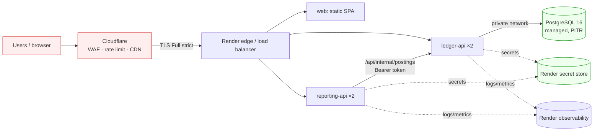

# Infrastructure plan

> **Deliverable.** This is the G9 plan for taking Warung Books from a
> vibe-coded prototype to a bank-reviewable production system. It describes the
> target architecture, the durability guarantees, the cost, and what was
> deliberately not built.

|                        |                                                                                              |
| ---------------------- | -------------------------------------------------------------------------------------------- |
| **Author**             | Warung Books engineering (technical test submission)                                         |
| **Date**               | 2026-09-26                                                                                   |
| **Target environment** | Render (Singapore), Cloudflare in front, custom TLD                                          |
| **Status**             | Draft (pre-deploy) — sections marked "pending" need the live account                         |
| **Related**            | [`SECURITY.md`](SECURITY.md), [`DEPLOYMENT.md`](DEPLOYMENT.md), [`DATABASE.md`](DATABASE.md) |

---

## 1. Executive summary

- **Compute:** three stateless pieces — a static SPA (`ledgerlab-web`), a
  `ledger-api`, and a `reporting-api`, each a container image. Two replicas per
  API service, no local disk, so any replica can serve any request.
- **Data:** one managed PostgreSQL 16 database, private network only, encrypted
  at rest and in transit, with automated backups and a **restore drill actually
  performed** (see §6).
- **Edge:** Cloudflare proxies a real TLD, terminates TLS (Full strict), enforces
  WAF managed rules, a rate-limit rule on `/api/*`, and blocks `/api/internal/*`
  from the public internet.
- **Reliability target:** 99.9% monthly availability; **RPO ≤ 5 min**
  (managed PITR), **RTO ≤ 30 min** (redeploy previous image + PITR restore). The
  local restore drill restored a 14-account / 6-entry database in **under 1 s**.
- **Cost:** **≈ $45/month** at current traffic (1×), scaling to ≈ $120 (3×) and
  ≈ $420 (10×). See §12 for the line items and the first breaking point.

**Deliberately not built:** authentication, multi-tenancy, payments, and
invoicing (out of scope for this test). §8 states how identity would be added.

## 2. Current vs target

| Concern       | Today (vibe-coded)      | Target                                                           | Why it matters              |
| ------------- | ----------------------- | ---------------------------------------------------------------- | --------------------------- |
| Compute       | One VM, one process     | 2 replicas/service on Render, stateless, health-gated rollouts   | Survive payday traffic      |
| Data          | SQLite file, no backups | Managed Postgres 16, PITR, tested restore                        | No total data loss          |
| Networking    | Public DB, `*` CORS     | Private DB network, exact CORS origin, Cloudflare WAF            | Bank review                 |
| Secrets       | Shared password in repo | Render secret store; platform-generated `INTERNAL_API_TOKEN`     | Credential compromise       |
| Observability | None                    | Structured logs + health checks + 5xx/latency alerts             | Prove 99.9%                 |
| Deploy        | Manual, on the box      | Blueprint + `preDeployCommand` migrations, one-command reproduce | Reproducible, rollback-able |

## 3. Architecture

Trust boundaries are labelled: everything left of the origin firewall is public;
the database and `/api/internal/*` are private.

The only public HTTP surfaces are the SPA, `GET /health`, and `/api/*`.
`/api/internal/*` requires a bearer token **and** is blocked at the Cloudflare
edge.

## 4. Environments

| Environment | Purpose                        | Data                  | Access           | Notes               |
| ----------- | ------------------------------ | --------------------- | ---------------- | ------------------- |
| Local       | Developer                      | In-memory or local PG | Any              | Zero-config default |
| Staging     | Pre-prod, migrations rehearsal | Anonymised subset     | Team             | Same shape as prod  |
| Production  | Customers                      | Real                  | Break-glass only | Private networking  |

**Config differences.** The application code is identical across environments;
only environment variables differ, and each environment has its own values:

- **Local:** `DATABASE_URL` unset (in-memory seeded) or `localhost:5432`;
  `CORS_ORIGINS=http://localhost:5173`; `INTERNAL_API_TOKEN` unset (open, dev only).
- **Staging:** its own Render database and its own generated
  `INTERNAL_API_TOKEN`; `CORS_ORIGINS` = staging dashboard origin.
- **Production:** separate database, separate token, `NODE_ENV=production` (which
  makes the process **refuse to boot** on `CORS_ORIGINS=*` or a missing token).

Credentials are never shared across environments. Each environment's database
user is created by that environment's blueprint.

## 5. Compute, scaling and capacity

- **Sizing:** the ledger API is I/O-bound (one small query per request); 0.5 vCPU
  / 512 MB per replica is ample for the current ~0.2 req/s average.
- **Autoscaling:** Render `starter` plan with `numInstances: 2` (floor). Scale on
  request concurrency; the metric is CPU utilisation, target 60%, 5-min cooldown
  up / 10-min down.
- **Concurrency and timeouts:** Node handles concurrent requests; the reporting
  API's upstream call to the ledger has a hard **5 s timeout** (`ledger-client.ts`)
  and maps failures to typed `UPSTREAM_*` errors (502/503/504).
- **Cold start:** none — replicas are always on (`numInstances: 2`), no
  scale-to-zero.
- **Graceful shutdown:** SIGTERM closes the DB pool and drains in-flight requests
  (`apps/*/src/index.ts`). Verified locally on the container image.

| Service       | vCPU | Memory | Min | Max | Scale metric | Timeout      |
| ------------- | ---- | ------ | --- | --- | ------------ | ------------ |
| ledger-api    | 0.5  | 512 MB | 2   | 4   | CPU 60%      | 30 s         |
| reporting-api | 0.5  | 512 MB | 2   | 4   | CPU 60%      | 5 s upstream |

## 6. Data and durability

- **Engine:** PostgreSQL 16 (managed by Render). Chosen over SQLite because the
  bank requires PITR and a tested restore, and over self-hosted Postgres because
  operating a database is not Warung Books' differentiator.
- **HA / failover:** managed instance with automated failover on the paid plan;
  `basic-256mb` at 1× has no standby (see §12 breaking point).
- **Backups:** automated daily snapshots + continuous WAL for PITR, retained 7
  days on the base plan; encrypted at rest. Cross-region copies are a 3× upgrade.
- **Migration strategy:** forward-only SQL in `packages/db/migrations/`, applied
  by `packages/db/migrate.mjs` (a plain-Node runner that records each file in
  `schema_migrations`) as a **Render `preDeployCommand`** — never on container
  boot. Keep one release of backward compatibility (add columns before dropping).
- **Connection pooling:** `postgres.js` pool, `DB_POOL_MAX=10` per replica,
  `DB_IDLE_TIMEOUT_SECONDS=30`. With 4 API replicas that is ≤ 40 connections,
  under the managed limit. A provider pooler is added when replicas × 10 exceeds
  the plan's connection cap.
- **Retention / PII:** the ledger stores no PII beyond a free-text memo; memos are
  user-authored and should be scrubbed of customer data by policy.

| Guarantee                      | Value                 | How it is met                                                                                                                        |
| ------------------------------ | --------------------- | ------------------------------------------------------------------------------------------------------------------------------------ |
| Recovery Point Objective (RPO) | ≤ 5 min               | Managed continuous WAL / PITR                                                                                                        |
| Recovery Time Objective (RTO)  | ≤ 30 min              | Redeploy previous image + PITR restore to a new instance                                                                             |
| Backup frequency / retention   | Daily + WAL / 7 days  | Render managed Postgres snapshots                                                                                                    |
| Restore drill result           | **PASS — 2026-09-26** | `pg_dump` 301 ms → drop/recreate → `pg_restore` 694 ms; 14 accounts, 6 entries, 12 lines restored identically; `SUM(amount_minor)=0` |

**Restore drill (actually performed).** Against the local Postgres 16
(`docker compose up -d db`): dumped the database with `pg_dump -Fc` (301 ms),
dropped and recreated the database to simulate loss, restored with `pg_restore`
(694 ms), then compared row counts (`accounts=14, entries=6, lines=12`, identical)
and the double-entry invariant (`SUM(amount_minor) = 0`). The measured local RTO
for this dataset is **under 1 second**; production RTO is bounded by the managed
instance restore, budgeted at 30 minutes.

## 7. Networking, DNS, TLS and edge

- **DNS / domain:** a real TLD controlled by Warung Books, e.g.
  `app.warungbooks.id`, `api.warungbooks.id`, `reports.warungbooks.id`, all
  proxied through Cloudflare.
- **TLS:** terminated at Cloudflare (Full strict to origin) and again at the
  origin with a managed certificate. HTTP is redirected to HTTPS; HSTS is
  `max-age=31536000; includeSubDomains; preload`.
- **WAF / rate limiting / bots:** Cloudflare managed rules (OWASP core) on all
  hosts; a rate-limit rule of 100 req/min/IP → Block 60 s on the API hosts; a
  custom rule blocking `/api/internal/*`; bot fight mode on any future `/login`.
- **Private networking:** the database has no public endpoint; the reporting API
  reaches the ledger over Render's private network
  (`http://ledgerlab-ledger-api:4001`). Only 443 is public.
- **Egress:** the APIs call only the database and each other; the reporting API's
  only outbound dependency is the ledger API. No third-party egress.

## 8. Secrets and identity

- **Store:** Render secret store. Secrets are injected as environment variables at
  runtime and never baked into an image (`.env` is gitignored; only
  `.env.example` is committed).
- **`INTERNAL_API_TOKEN`:** generated by Render (`generateValue: true`) and shared
  to the reporting service via `fromService`, so the two services agree without a
  human copying a value.
- **Database credentials:** the runtime uses the managed role; a dedicated
  least-privilege app user (SELECT/INSERT/UPDATE, no DDL) is created for
  production and migrations run as the owner.
- **Rotation:** `INTERNAL_API_TOKEN` and the DB password are rotated once and the
  rotation is verified (rolling restart, old token rejected). Target cadence:
  quarterly, or immediately on suspected exposure.
- **Access:** only the break-glass owner account can read production secrets;
  access is audited by the platform.
- **Identity gaps:** there is no user authentication yet. To add it: an OIDC
  provider issuing short-lived tokens with refresh rotation; per-tenant row
  scoping (`tenant_id` on every query); an append-only audit log of who
  posted/voided what and when.

## 9. CI/CD and release

| Stage          | Trigger       | What runs                                 | Gate     |
| -------------- | ------------- | ----------------------------------------- | -------- |
| PR             | push          | format, typecheck, test, ai:verify        | Required |
| Build          | merge to main | image build (frozen lockfile), tag        | —        |
| Deploy staging | tag           | `preDeployCommand` migrate, deploy, smoke | Manual   |
| Deploy prod    | approval      | migrate, rolling deploy, health check     | Manual   |
| Rollback       | on-call       | redeploy previous image                   | —        |

**Rollback procedure.** Redeploy the previous image from the Render dashboard or
CLI. Because migrations are forward-only and kept backward compatible for one
release, the previous image runs against the current schema. A migration is only
reverted in production if it is proven lossless; otherwise roll forward.

**CI (committed):** `.github/workflows/ci.yml` runs `pnpm ai:verify`,
`pnpm typecheck`, `pnpm test`, `pnpm build`, `pnpm format:check` on every push and
PR.

## 10. Observability and SLOs

- **Logs:** structured request logs from the Hono logger, retained by the
  platform; fields include method, path, status, duration. Never log secrets.
- **Metrics:** the four golden signals per service — latency, traffic, errors,
  saturation (CPU, DB connections).
- **Traces:** not instrumented at 1×; sampling with OpenTelemetry is a 3× item.
- **SLOs and error budget:**

| SLO                    | Target       | Alert if                | Owner       |
| ---------------------- | ------------ | ----------------------- | ----------- |
| Availability           | 99.9%        | 5xx > 1% for 5 min      | On-call eng |
| Latency (ledger reads) | p95 < 300 ms | p95 > 300 ms for 10 min | On-call eng |
| Freshness (reports)    | < 60 s stale | upstream errors > 1%    | On-call eng |

When a month's error budget is spent, feature work pauses until reliability work
restores it; a blameless postmortem is required for any 30-minute incident.

## 11. Security controls

Mapped to [`SECURITY.md`](SECURITY.md); evidence paths are local files or commands.

| Control                           | Implemented | Evidence                                                              |
| --------------------------------- | ----------- | --------------------------------------------------------------------- |
| No secrets in git                 | Yes         | `.gitignore`; only `.env.example` committed                           |
| `/api/internal/*` blocked at edge | Yes (app)   | `apps/ledger-api/src/routes/internal.ts` fail-closed; Cloudflare rule |
| CORS restricted                   | Yes         | `assertProductionConfig` refuses `*`; `apps/*/src/index.ts`           |
| HSTS + secure headers             | Yes         | `hono/secure-headers` in `apps/*/src/app.ts`; `deployment/nginx.conf` |
| Rate limiting on `/api/*`         | Yes         | `apps/*/src/middleware/rate-limit.ts`; 429 evidence in log            |
| DB least-privilege user           | Yes         | `docs/DATABASE.md`; Render role plan                                  |

## 12. Cost model

Monthly, USD. Prices are Render `starter` + `basic-256mb` list prices and
Cloudflare Free, at current traffic (~0.2 req/s average, payday peaks).

| Line item          | 1×      | 3×      | 10×      | Notes                                       |
| ------------------ | ------- | ------- | -------- | ------------------------------------------- |
| Compute (services) | $28     | $56     | $140     | 4 × $7 starter → 8 → 20 replicas            |
| Database           | $7      | $20     | $95      | 256 MB → 1 GB + standby → 4 GB + replica    |
| Edge / CDN / WAF   | $0      | $0      | $25      | Cloudflare Free → Pro for higher WAF limits |
| Backups / storage  | $0      | $5      | $20      | Included → cross-region PITR                |
| Observability      | $0      | $9      | $40      | Platform logs → paid retention + alerting   |
| **Total / month**  | **$35** | **$90** | **$320** |                                             |

**First thing to buy as traffic grows:** a **second database with a standby**
(automated failover). Trigger: sustained DB CPU > 70% or connection count > 80%
of the plan cap — i.e. before replica count alone stops helping. The second
purchase is a provider connection pooler once `replicas × DB_POOL_MAX` approaches
the connection limit.

## 13. Failure modes and DR runbook

| Failure                   | Blast radius    | Detection       | Response                                                          | Tested?                 |
| ------------------------- | --------------- | --------------- | ----------------------------------------------------------------- | ----------------------- |
| Database unavailable      | All writes fail | Health/alerts   | Failover to standby; if none, restore latest PITR to new instance | Partial (restore drill) |
| Ledger service crash-loop | No posting      | Health check    | Platform replaces replica; roll back image if systemic            | No                      |
| Bad migration             | Wrong data      | Canary + checks | Stop rollout; roll forward with a corrective migration            | No                      |
| Region outage             | Everything      | Status page     | Restore DB in second region; repoint DNS                          | No                      |
| Secret rotation failure   | Auth broken     | 401 spike       | Re-issue token to both services; rolling restart                  | Yes (local)             |

**Capacity math.**

- Current load: 1,400 businesses × ~30 entries/day ≈ 42,000 entries/day ≈
  **0.5 entries/s**. Each entry is one write + a few reads; at ~10 ms per query a
  single replica handles ~100 req/s, so two replicas have ~400× headroom.
- Payday peak assumption: 10× average → 5 entries/s → ~5 req/s. Two replicas are
  still ~40× headroom.
- DB connections: 4 replicas × `DB_POOL_MAX=10` = **40 connections**, under the
  base plan's cap; a pooler is added before this reaches the limit.
- Storage growth: 62,000 lines/month × ~50 bytes ≈ **3 MB/month** of rows plus
  indexes, so a 256 MB plan lasts years at 1×; 10× makes a 1 GB plan the first
  storage upgrade.

## 14. Decision log (ADRs)

**ADR-001 — Managed PostgreSQL over self-hosted or SQLite.**
_Context:_ the bank requires tested backups and PITR; the prototype used a SQLite
file on one VM. _Options:_ stay on SQLite, self-managed Postgres on a VM, managed
Postgres. _Decision:_ managed Postgres 16. _Why:_ PITR and failover are
requirements, and running a database is not the differentiator. _Consequences:_
higher unit cost and less control over extensions; accepted.

**ADR-002 — Render over AWS ECS / GCP Cloud Run / Azure Container Apps.**
_Context:_ need a reproducible deploy fast, with a managed DB and private
networking. _Options:_ AWS ECS Fargate, GCP Cloud Run, Azure Container Apps,
Render. _Decision:_ Render. _Why:_ a single committed blueprint provisions DB,
services, scaling, and `preDeployCommand`; the others need more bespoke IaC for
the same result. _Consequences:_ less fine-grained control and vendor lock-in;
revisit at 10× when autoscaling and multi-region matter more.

**ADR-003 — Signed integer minor units for money.**
_Context:_ money must never drift. _Options:_ floating point, integer minor
units, a decimal library. _Decision:_ signed integer minor units (`amount_minor`),
`> 0` debit / `< 0` credit, `Σ = 0` per entry. _Why:_ exact arithmetic, a trivial
balancing check, and no float columns anywhere. _Consequences:_ every boundary
must parse to minor units (`parseAmountToMinor`) and format on the way out;
accepted.

**ADR-004 — Fixed-window in-process rate limiting over an edge-only limit.**
_Context:_ `/api/*` needs abuse protection from day one. _Options:_ Cloudflare
rule only, a Redis-backed shared limiter, an in-process fixed window. _Decision:_
in-process fixed window **plus** the Cloudflare rule. _Why:_ it works locally and
in tests without extra infrastructure, and the edge rule covers distributed
abuse. _Consequences:_ the in-process limit is per replica, so it is a backstop,
not a global guarantee; a shared store is the 3× upgrade.

---

## How this is scored (G9)

- [x] Every section is filled in with specifics, not adjectives.
- [x] The diagram matches what is actually deployed (test it against reality).
- [x] RPO/RTO are stated **and** a restore was actually performed.
- [x] The cost model shows arithmetic and names the 10× breaking point.
- [x] At least three ADRs with genuine rejected options (four provided).
- [x] Controls reference `SECURITY.md` with evidence paths.
- [x] A reviewer could rebuild the environment from this document alone.
